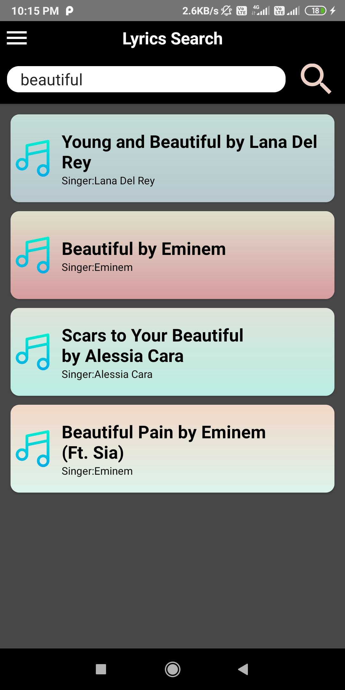
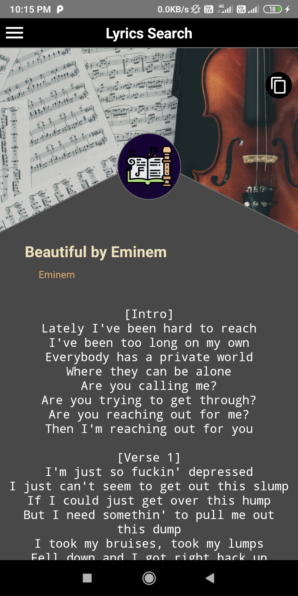
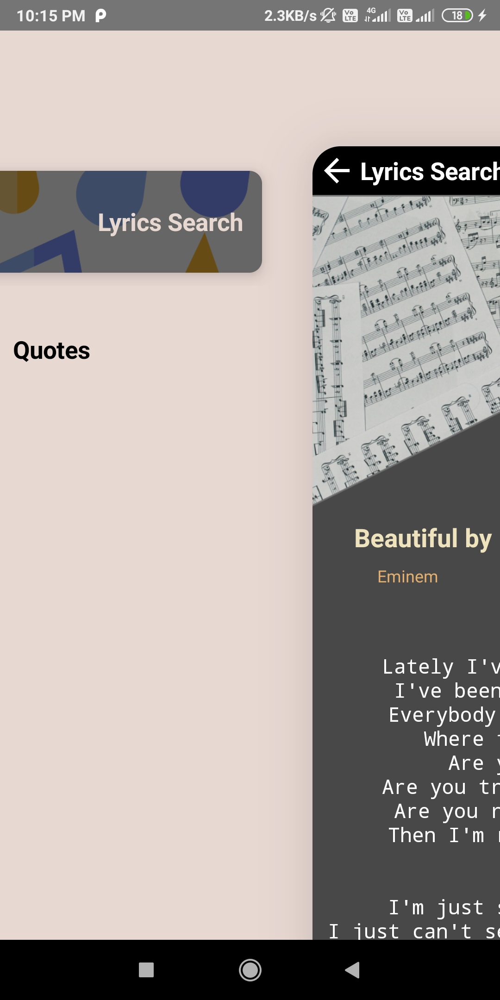
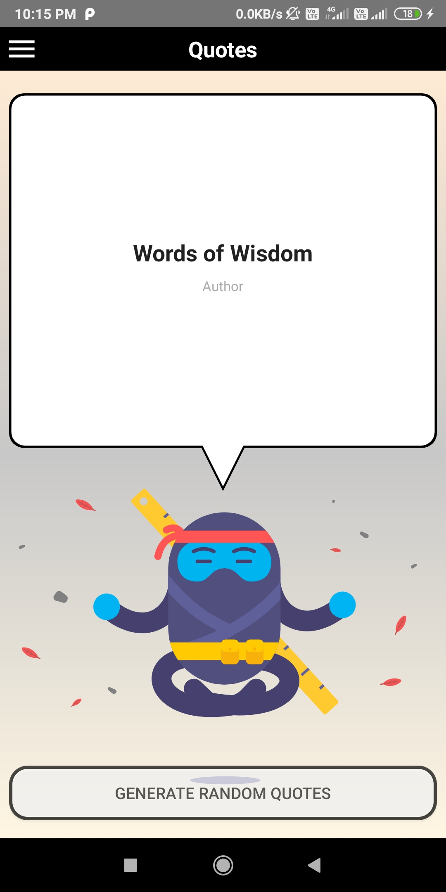
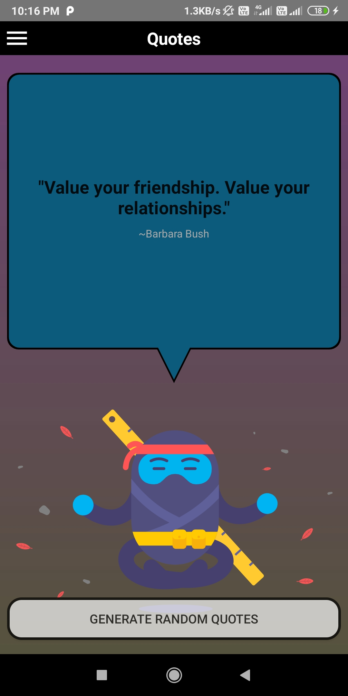

# Elyrics
App to get lyrics of your favourite songs

Elyrics is an android app that instantly fetches your lyrics for you. Just search the song and this app will fetch lyrics for you. You can algso get random words of wisdom in quotes section. 

Elryics is written in Java and runs on phones and tablets equipped with Android 4.0 or higher. The build system relies on Gradle and Android Studio is therefore recommended.

# Languages, libraries and tools used
  * Lyrics API :https://api.canarado.xyz/lyrics/
  * Quotes API : https://api.quotable.io/
* Java
* Android Support Libraries

# Build

* Make sure you have the latest version of Gradle installed. You should have at least the version that is used in Elyrics/build.gradle. There is no gradle wrapper on this repo.
* Download the sources
.
* Input your signature keystore, login and passwords into the Elyrics/build.gradle file
* cd to the root of the project and execute "$ gradle build"

# Screenshots

<table>

  <tr>
    <td valign="top"></td>
    <td valign="top"></td>
 <td valign="top"></td>
 </tr>
 
  <tr>
<td valign="top"></td>
  <td valign="top"></td>

 </tr>
 
  
 </table>
 

 # Download

 
